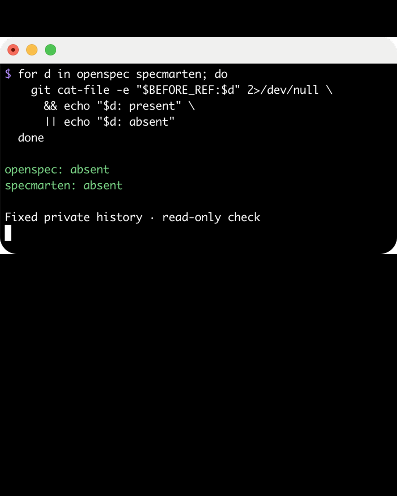
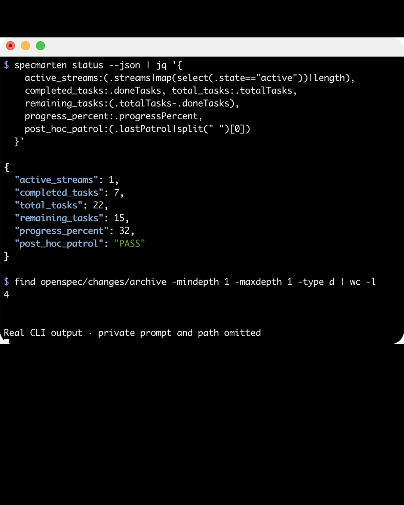
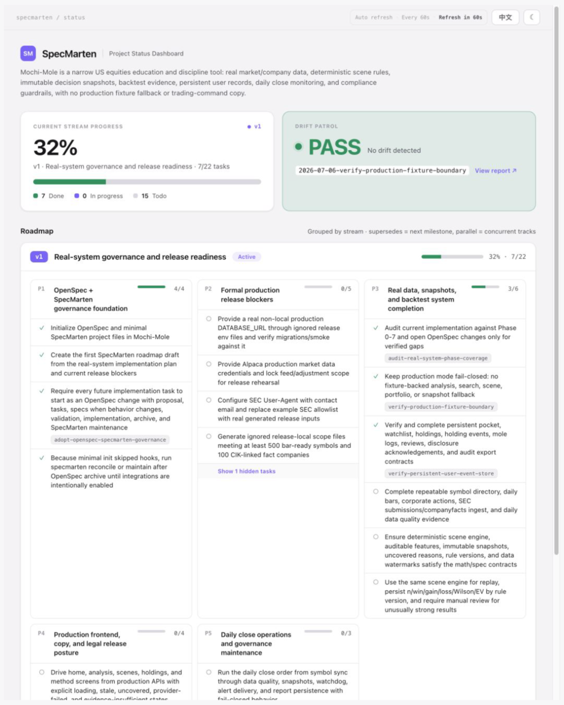

# Private investment-research product: reviewed evidence export

This case study is a reviewed public evidence export derived from the real history of an unfinished private investment-research product.

External readers cannot clone the private source repository or independently reproduce the source history. The package therefore documents the fixed evidence and verification boundary without claiming full external reproducibility.

All displayed numbers came from a real project state at a fixed internal snapshot:

- 1 active stream
- 22 total tasks
- 7 completed tasks
- 15 remaining tasks
- 32% progress
- 4 archived changes
- one post-hoc drift patrol verdict: PASS

The public export intentionally includes one partial, unredacted dashboard viewport after owner review. It shows the product name, project mission, stream label, and some task labels. It does not include source code, a repository address, local paths, private commit identifiers, or secret values, and it does not expose the complete roadmap.

An AI session read, understood, and organized the project history. SpecMarten CLI supplied deterministic context, validated the reviewed state, wrote the patrol report, and generated the view.

The result is a reviewable governance record, not a completion claim. The project remains unfinished.

`PASS` is the verdict of one post-hoc drift patrol performed on 2026-07-11. It does not mean that all tests passed, that the code is correct, that the product is complete or launch-ready, or that all historical work complies with every rule.

SpecMarten is independent companion tooling for OpenSpec, not an official OpenSpec project.

## Image provenance

- Before is a direct terminal screenshot of a read-only Git check against the fixed private history. The private reference, prompt, and local path are not displayed.
- Workflow is a direct terminal screenshot of a real `specmarten status --json` projection plus a real archived-change count. The private prompt and local path are not displayed.
- After is an unredacted first viewport of the real generated SpecMarten dashboard. It is a partial page capture, not the complete roadmap.
- The short video uses only these three reviewed portrait views.

## Visual summary

| Before | Workflow | After |
| --- | --- | --- |
|  |  |  |

[Watch the 8-second portrait video](assets/specmarten-private-investment-research-1080x1350.mp4).
