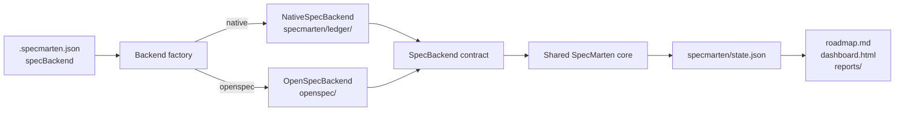
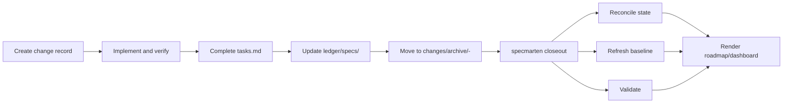

# Native backend architecture and workflow

> Status: implemented in the current unreleased worktree. The published `0.1.2` package does not contain this behavior yet.

## Purpose

SpecMarten can now run without an OpenSpec project. New projects use a native change ledger by default, while existing OpenSpec projects remain supported through the same backend contract.

The goal is backend independence for SpecMarten's project-governance capabilities:

- roadmap and stream state;
- active and archived change progress;
- baseline snapshots and drift detection;
- client-first plan, backfill, maintain, and check context;
- deterministic validation, status, next-step guidance, and generated views.

This change does not remove OpenSpec support or recreate the full OpenSpec CLI.

## Architecture



The shared core does not read `openspec/` or `specmarten/ledger/` directly. It asks `SpecBackend` for:

- active and archived changes;
- proposals, task checklists, and spec deltas;
- accepted specs;
- current change marker;
- accepted-spec hash and snapshot.

The selected adapter supplies those facts. Reconciliation, baseline handling, drift checks, state writes, and rendering remain shared.

## Single source of truth

Each repository selects exactly one change-ledger backend:

| Configuration | Change ledger | Global state |
| --- | --- | --- |
| `"specBackend": "native"` | `specmarten/ledger/` | `specmarten/state.json` |
| `"specBackend": "openspec"` | `openspec/` | `specmarten/state.json` |

SpecMarten does not dual-write or live-synchronize the two ledgers. If both layouts exist, `.specmarten.json` wins. Without configuration, an existing `openspec/` project is preferred for backward compatibility; otherwise initialization selects native. Code paths that inspect a completely uninitialized directory before `init` retain an OpenSpec fallback for compatibility; `init` is the authority for new-project selection and writes the native choice to configuration.

## Native ledger layout

```text
specmarten/
  ledger/
    changes/
      <change-id>/
        proposal.md
        tasks.md
        specs/<capability>/spec.md
      archive/
        <date>-<change-id>/
          proposal.md
          tasks.md
          specs/<capability>/spec.md
    specs/
      <capability>/spec.md
  state.json
  baseline/
  reports/
  roadmap.md
  dashboard.html
```

`ledger/changes/` and `ledger/specs/` are authored facts. `state.json` is the global semantic model. `roadmap.md` and `dashboard.html` are generated views and must not be edited by hand.

## Backend selection

| Starting state or command | Selected backend |
| --- | --- |
| New repository, `specmarten init` | `native` |
| Existing `openspec/`, `specmarten init` | `openspec` |
| `specmarten init --backend native` | `native` |
| `specmarten init --backend openspec` | `openspec`, requires existing OpenSpec |
| `specmarten init --bootstrap` | bootstraps and selects `openspec` |
| Existing `.specmarten.json` | configured value; conflicting CLI selection fails |

Do not migrate an existing project by changing only `specBackend`. There is no automatic OpenSpec-to-native migration command in this release.

## Native lifecycle



In the first native release, the current AI session owns semantic lifecycle writes:

1. Create `proposal.md`, `tasks.md`, and capability deltas before implementation.
2. Implement the smallest change and run verification.
3. Mark the checklist complete.
4. Semantically update accepted documents under `ledger/specs/`.
5. Move the change under the date-prefixed archive path.
6. Run `specmarten closeout`.

OpenSpec projects continue to use native OpenSpec propose/apply/archive operations, followed by the same `specmarten closeout` path.

## Command behavior

| Command | Native backend | OpenSpec backend |
| --- | --- | --- |
| `init` | creates `specmarten/ledger/` | requires or bootstraps `openspec/` |
| `status`, `next` | reads native ledger | reads OpenSpec ledger |
| `backfill`, `maintain`, `check` | context exposes neutral `ledger` data | same, backed by OpenSpec |
| `validate --complete` | checks native active checklists | checks OpenSpec active checklists |
| `baseline refresh` | snapshots `ledger/specs/` | snapshots `openspec/specs/` |
| `closeout` | reconcile, render, baseline, validate | same shared closeout |

Context envelopes expose `specBackend` and a neutral `ledger` object. The legacy `openSpec` field is deprecated, remains an alias through the `0.x` line for compatibility, and should not be used by new integrations. Removal will happen no earlier than `1.0` with migration notice.

## Validation boundaries

Shared checks include:

- backend presence;
- active checklist completion;
- change-to-roadmap reconciliation;
- stale generated views;
- baseline drift;
- available local agent integrations.

OpenSpec-only checks, such as accepted specs containing `Purpose: TBD`, run only when `specBackend` is `openspec`.

Native validation uses backend-neutral machine codes: `change-active-unlinked`, `change-archived-unlinked`, and `change-active-incomplete`. OpenSpec projects retain the historical `openspec-*` equivalents so existing automation does not break.

## Compatibility and limitations

- Existing OpenSpec configuration and file layout remain valid.
- One repository has one configured backend authority.
- Native and OpenSpec changes are isolated even if both directories exist.
- Local metadata such as `.DS_Store` is excluded from markers, hashes, and snapshots.
- Date-prefixed archive folders work at the top level or inside year-grouped directories.
- Native lifecycle is file-oriented; there is no `specmarten archive` command yet.
- Claude Code's generated post-tool hook intentionally watches both `openspec/` and `specmarten/ledger/` paths so either configured backend can trigger reconciliation.
- There is no automatic migration, dual-write, or two-way synchronization.
- The current implementation is not committed, pushed, or published.

## Verification

Required local gates:

```sh
npm run typecheck
npm test
npm run build
npm pack --dry-run
specmarten validate --complete
openspec validate --all --strict
git diff --check
```

Native verification must also include an empty-directory smoke showing that `specmarten init` creates `specmarten/ledger/`, does not create `openspec/`, and subsequently passes `status` and `validate`.
